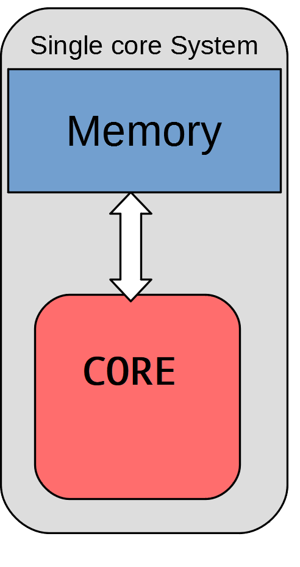
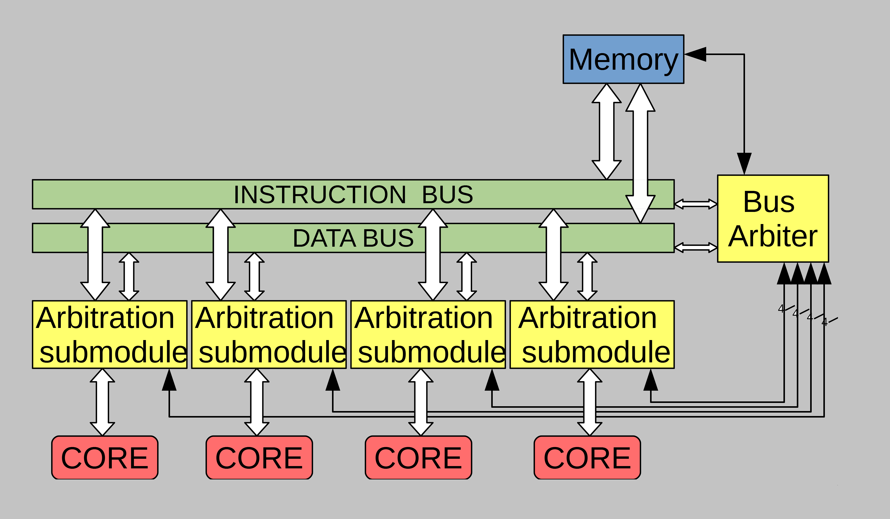

## Implementation of a multi-core system based on the MIPS32 processor

>Created by [Odysseas Papadakis](https://github.com/odypapadakis/)  
>README created using [Ghostwriter](https://github.com/michelolvera/vs-ghostwriter)  
>Core taken from: [Here ](https://github.com/grantae/mips32r1_xum)

---
### The goal of this project is to go

## From this:

## To this:

#### The file structure is as follows:
* The "Verilog" Folder, contains all of the Verilog files in one place.
* Each individual component of the design is stored additionally in a seperate subfoler ( apart from README_Images ) which is split into subfolders.
#### 1 SIMVISION 	--> Simulation and verification for the HDL of the component
#### 2 DC 			--> Synthesis
#### 3 INNOVUS 		--> Placement and routing of the cells on the die
#### 4 VIRTUOSO 		--> Final touchups and corrections of on die problems
#### 5 ABSTRACT 		--> Macro CELL creation